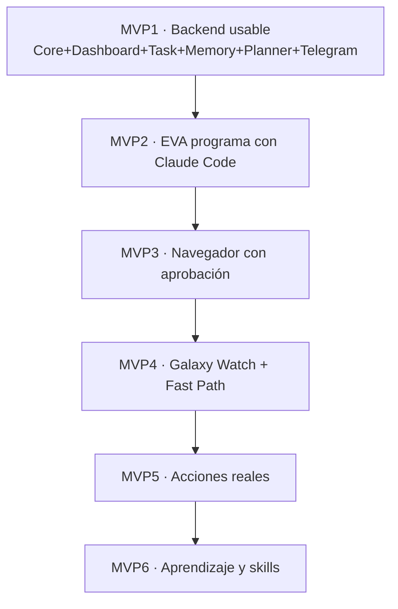

# 06 · Plan de Ejecución por Fases

→ [[00 - EVA · Índice Maestro (MOC)|índice]] · anterior [[05 - Base de Datos Supabase (Esquema + RLS)]]

Cada fase es **entregable y testeable**. La columna *Supabase* indica qué migración aplicar antes de empezar la fase. Los prompts de cada fase están en [[07 - Prompts por Fase (para Claude Code)]].

---

## Línea de tiempo


---

## Tabla maestra de fases

| Fase | Entregable | Migración Supabase | MVP |
|------|------------|--------------------|-----|
| **0 · Diseño** | Este vault + diagramas | — | — |
| **1 · Core mínimo** | API Gateway, Auth, Task Engine, Event Bus, WebSocket | `001`,`002`,`003`,`004`,`013`,`014` | MVP1 |
| **2 · Dashboard** | Panel Next.js (login, tareas, nodos, eventos, logs) | — (usa tablas de F1) | MVP1 |
| **3 · Memory System** | Memory Agent, embeddings, búsqueda semántica | `005` + RLS de `005` en `014` | MVP1 |
| **4 · Planner + LLM** | Model Router, Planner, Tool Router, Intent Router | — | MVP1 |
| **5 · Server/Desktop Node** | Node App, heartbeat, capability registry | `003` (si no se aplicó) | — |
| **6 · Dev Manager + Claude Code** | Project Registry, Repo Manager, CC Controller, Dev Queue | `010` + RLS | MVP2 |
| **7 · Browser Agent** | Playwright, perfiles, screenshots | `009` + RLS | MVP3 |
| **8 · Approval Engine** | Niveles 0–3, action_hash, UI aprobación | `006` + RLS | MVP3 |
| **9 · Communication Hub** | Telegram, Discord, email, push | `007` + RLS | MVP1/3 |
| **10 · Skill System** | Registry, loader, permisos, versioning | `008` + RLS | MVP6 |
| **11 · MCP Manager** | Gateway MCP, adapters GitHub/Supabase/Google/AWS | — | — |
| **12 · Experience System** | Traces, feedback, detección de patrones | `012` + RLS | MVP6 |
| **13 · Wear Token Service** | Tokens temporales, policy, cost guard | `011` + RLS | MVP4 |
| **14 · Wear OS App** | Kotlin, mascota Canvas, Fast/Core Path | — (usa `011`) | MVP4 |
| **15 · Android Companion** | Notification Listener, puente | — | — |
| **16 · Uber Skill** | Perfil browser, preparar, aprobar, comprobante | usa `006`,`009` | MVP5 |
| **17 · Auto Skill Creation** | Detectar patrones → crear skill | usa `008`,`012` | MVP6 |
| **18 · Seguridad avanzada** | Sandbox, anti-injection, hash-chaining, rotación | hardening de `013` | — |
| **19 · Optimización** | Cache, Model Router, métricas, latencia | — | — |

---

## Hitos (MVPs)



## Definición de "hecho" por fase (gate)

Cada fase NO se cierra hasta que:
1. **Build + lint + tests** pasan (`npm run build && npm run lint && npm test`).
2. **Migración aplicada** y **RLS verificado** (`select` cruzado entre orgs devuelve 0 filas).
3. **Diff revisado** por el Code Review Agent ([[09 - Web Panel estilo Hermes Agent|panel]] → Dev).
4. **Evento** `dev.task.completed` emitido y reportado.
5. La fase tiene su **README** corto en `docs/`.

## Orden recomendado real (resumen)

`Core → Dashboard → Memory → Planner → Nodes → Dev Manager → Browser → Approval → Comm Hub → Skills → MCP → Experience → Wear Token → Wear App → Android → Uber → Auto Skill → Seguridad → Optimización`

> 💡 **El camino más inteligente es usar EVA para construir EVA**: en cuanto MVP2 esté listo, las fases siguientes se delegan a Claude Code desde el propio EVA, con los [[07 - Prompts por Fase (para Claude Code)|prompts]] de cada fase.

---
# EVA — Documentación Técnica Integral del Proyecto

## 1. Resumen Ejecutivo

**EVA** es una plataforma agentica distribuida diseñada para funcionar como asistente personal, operador de navegador, coordinador de tareas, sistema de memoria, orquestador de nodos, asistente de desarrollo de software y rostro inteligente en Wear OS.

EVA no debe construirse como una simple app para reloj. La arquitectura correcta es una plataforma completa dividida en:

```text
EVA Cloud Core
= cerebro central, agentes, memoria, skills, MCP, tareas, aprobaciones, dashboard, desarrollo y orquestación

EVA Nodes
= aplicaciones instalables en Mac, Windows, Linux, Android, Wear OS y servidores

EVA Interfaces
= Galaxy Watch, dashboard web, Telegram, Discord, WhatsApp, email, voz y navegador

EVA Fast Path
= ruta rápida para respuestas simples desde Wear OS usando token temporal
```

El **Galaxy Watch** será la interfaz emocional, rápida y portátil de EVA, pero el trabajo pesado se ejecutará en el backend principal o en nodos conectados como Mac, Windows, Linux o servidores.

---

## 2. Objetivo del Proyecto

Crear una plataforma capaz de:

* Escuchar comandos desde un Galaxy Watch.
* Responder mediante voz y una mascota geométrica animada.
* Dar respuestas rápidas desde Wear OS mediante Fast Path.
* Leer notificaciones permitidas.
* Navegar en internet usando sesiones reales.
* Usar cuentas autenticadas como Google, WhatsApp Web, Uber, Gmail, AWS, etc.
* Preparar acciones sensibles y pedir aprobación humana antes de ejecutarlas.
* Enviar mensajes por Telegram, Discord, email, WhatsApp u otros canales.
* Recordar tareas, preferencias, experiencias y decisiones técnicas.
* Crear y mejorar skills con el tiempo.
* Usar MCP como sistema estándar de conexión a herramientas.
* Controlar nodos instalados en computadoras.
* Usar Claude Code para programar, revisar estado, ejecutar tareas en cola y reportar avances.
* Recomendar siguientes pasos de desarrollo.
* Ayudar a construir EVA misma.

---

## 3. Visión de Alto Nivel

```text
Usuario
  ↓
Wear OS / Android / Dashboard / Telegram / Discord / Email
  ↓
Intent Router
  ├── Fast Path
  │     ↓
  │   Respuesta rápida desde Wear OS con token temporal
  │
  └── Core Path
        ↓
      EVA Cloud Core
        ↓
      Planner + Agents + Memory + Skills + MCP + Browser + Approval Engine
        ↓
      Node Manager
        ↓
      Mac / Windows / Linux / VPS / Android / Galaxy Watch
        ↓
      Herramientas: navegador, terminal, archivos, Claude Code, Docker, apps, APIs
```

EVA será una plataforma donde:

```text
El Core piensa.
El Fast Path responde rápido.
Los nodos ejecutan.
El navegador observa.
La memoria recuerda.
Las skills aprenden.
MCP conecta.
El Approval Engine protege.
El reloj comunica.
Claude Code programa.
El Dev Manager coordina el desarrollo.
```

---

## 4. Principios Arquitectónicos

### 4.1 El reloj no es el cerebro principal

El Galaxy Watch no debe procesar tareas pesadas.

Debe encargarse de:

* Voz.
* Interfaz visual.
* Mascota geométrica.
* Notificaciones rápidas.
* Aprobaciones.
* TTS.
* Sensores.
* Estados de tareas.
* Fast Path para respuestas simples.
* Fallback al Core para tareas complejas.

El procesamiento pesado ocurre en:

* EVA Cloud Core.
* VPS.
* Mac.
* Windows.
* Linux.
* Otros nodos.

---

### 4.2 El reloj sí puede tener una ruta rápida

El reloj puede iniciar respuestas rápidas usando un **Fast Path**, pero no debe guardar API keys permanentes.

Arquitectura:

```text
Galaxy Watch
  ↓
Solicita token temporal
  ↓
EVA Core valida usuario/dispositivo
  ↓
Core emite token temporal
  ↓
Watch abre sesión rápida de IA
  ↓
Respuesta inmediata
```

Esto permite baja latencia para:

* Traducción.
* Respuesta breve.
* Reformulación.
* Resumen corto de notificación.
* Conversación simple.
* Explicación rápida.

No debe usarse para:

* Pedir Uber.
* Comprar.
* Navegar en sesiones personales.
* Usar Claude Code.
* Desplegar producción.
* Acceder a secretos.
* Modificar bases de datos.
* Ejecutar acciones sensibles.

---

### 4.3 El Core es la fuente de verdad

El **EVA Cloud Core** debe ser el sistema principal.

Ahí viven:

* Usuarios.
* Tareas.
* Memoria.
* Skills.
* Nodos.
* Agentes.
* Sesiones.
* Logs.
* Aprobaciones.
* Roadmap.
* Proyectos.
* Costos.
* Experiencias.
* Políticas de Fast Path.
* Tokens temporales.
* Registro de uso.
* Control de seguridad.

---

### 4.4 Los nodos son ejecutores

Los nodos no deberían decidir la estrategia general.

Cada nodo solo expone capacidades:

```text
browser.open()
browser.click()
browser.screenshot()
terminal.run()
file.read()
file.write()
docker.run()
claude_code.run()
notification.read()
tts.speak()
microphone.listen()
```

El Core decide:

```text
Qué hacer
Dónde hacerlo
Con qué herramienta
Con qué modelo
Con qué nivel de aprobación
```

---

### 4.5 Toda acción sensible requiere aprobación

EVA puede preparar una acción, pero no debe ejecutarla sin confirmación cuando hay riesgo.

Ejemplos de acciones sensibles:

* Pedir Uber.
* Comprar algo.
* Enviar dinero.
* Cambiar DNS.
* Desplegar producción.
* Borrar archivos.
* Ejecutar migraciones.
* Modificar variables de entorno.
* Enviar mensajes importantes.
* Confirmar reservaciones.
* Usar cuentas autenticadas en servicios personales.

---

### 4.6 MCP como capa estándar

MCP debe usarse como sistema estándar para conectar EVA con herramientas externas.

Debe permitir integrar:

```text
GitHub
Google Drive
Gmail
Calendar
Supabase
PostgreSQL
AWS
Docker
Kubernetes
Notion
Slack
Discord
Custom tools
```

---

### 4.7 Playwright para navegación

El Browser Agent debe usar Playwright como primera opción.

Debe permitir:

* Navegación con perfiles persistentes.
* Capturas de pantalla.
* Extracción de texto.
* Llenado de formularios.
* Sesiones autenticadas.
* Preparación de acciones sensibles.
* Confirmación mediante Approval Engine.

---

### 4.8 Claude Code como programador, EVA como manager

EVA no reemplaza Claude Code.

EVA debe funcionar como:

```text
Product Manager
Project Manager
DevOps
Supervisor
QA
Roadmap Assistant
Notification System
```

Claude Code debe funcionar como:

```text
Coding Agent
Editor
Terminal assistant
Implementador de tareas
```

EVA debe mandar tareas a Claude Code, monitorear el resultado, correr tests, revisar diffs, pedir aprobación si hay riesgo y sugerir siguientes pasos.

---

## 5. Stack Tecnológico Recomendado

### 5.1 Backend

```text
Lenguaje: TypeScript
Framework: NestJS o Fastify
Realtime: WebSocket
Jobs: BullMQ
Queue/Cache: Redis
Base de datos: Supabase PostgreSQL
Vector DB inicial: pgvector
Vector DB futuro: Qdrant
Browser Automation: Playwright
Contenedores: Docker
Deploy: VPS Ubuntu
```

---

### 5.2 Dashboard

```text
Framework: Next.js
UI: Tailwind CSS
Realtime: WebSocket
Auth: Supabase Auth o Auth.js
Charts/logs: Grafana opcional
```

---

### 5.3 Wear OS

```text
Lenguaje: Kotlin
UI: Jetpack Compose for Wear OS
Animación: Canvas
Voz: SpeechRecognizer / API externa
TTS: Android TextToSpeech
Comunicación: REST/WebSocket
Fast Path: cliente con token temporal
Core Path: cliente REST/WebSocket hacia EVA Core
Integración Android: Data Layer API
```

---

### 5.4 Android Companion

```text
Lenguaje: Kotlin
Notificaciones: Notification Listener Service
Comunicación reloj-teléfono: Wearable Data Layer
Comunicación Core: REST/WebSocket
```

---

### 5.5 Desktop Node

```text
Framework: Tauri o Electron
Runtime: Node.js
Browser Automation: Playwright
Terminal: shell controlado
File System: permisos explícitos
Claude Code: CLI controller
Docker: opcional
```

---

### 5.6 IA

```text
OpenAI Responses API
OpenAI Realtime para Fast Path
OpenAI Agents SDK
Claude API
Claude Code CLI
Gemini opcional para visión/OCR
Embeddings para memoria vectorial
Model Router propio
```

---

## 6. Estructura de Repositorios

Recomendación inicial: **monorepo**.

```text
eva/
  apps/
    eva-core/
    eva-dashboard/
    eva-node-desktop/
    eva-watch/
    eva-android/
  packages/
    shared-types/
    sdk/
    tool-protocol/
    skill-runtime/
    mcp-adapters/
    browser-runtime/
    approval-client/
    fast-path-client/
    claude-code-controller/
  infra/
    docker/
    postgres/
    redis/
    nginx/
  docs/
    architecture.md
    roadmap.md
    security.md
    skills.md
    nodes.md
    dev-agent.md
    fast-path.md
```

Alternativa futura: separar en múltiples repositorios cuando el proyecto crezca.

---

## 7. Arquitectura Principal

```text
EVA Cloud Core
├── API Gateway
├── Auth Service
├── Agent Orchestrator
├── Planner Agent
├── Intent Router
├── Tool Router
├── MCP Manager
├── Skill Registry
├── Skill Generator
├── Browser Service
├── Memory Service
├── Vector Memory
├── Communication Hub
├── Approval Engine
├── Task Engine
├── Event Bus
├── Node Manager
├── Model Router
├── Cost Manager
├── Experience System
├── Observer Agent
├── Wear Fast Path Service
├── Development Control Center
└── Dashboard API
```

---

# 8. Módulos del EVA Cloud Core

## 8.1 API Gateway

Punto de entrada principal.

Canales soportados:

```text
Wear OS
Android App
Dashboard Web
Telegram Bot
Discord Bot
WhatsApp
Email
REST API
WebSocket
MCP
Fast Path Token Requests
```

Responsabilidades:

* Autenticación.
* Rate limiting.
* WebSocket.
* Validación de requests.
* Enrutamiento al Agent Orchestrator.
* Registro de mensajes entrantes.
* Manejo de sesiones.
* Recepción de solicitudes de token temporal para Wear OS.

---

## 8.2 Auth Service

Responsable de identidad y permisos.

Debe manejar:

* Usuarios.
* Dispositivos.
* Nodos.
* Tokens.
* Sesiones.
* Roles.
* Permisos por herramienta.
* Permisos por skill.
* Permisos por Fast Path.
* Revocación de acceso.

---

## 8.3 Intent Router

El **Intent Router** decide si una petición debe ir por Fast Path o Core Path.

```text
Petición simple
  ↓
Fast Path

Petición compleja
  ↓
Core Path

Petición sensible
  ↓
Core Path + Approval Engine
```

### Fast Path

Usar para:

```text
- conversación corta
- traducción rápida
- reformular mensaje
- resumen corto de notificación
- generar respuesta breve
- pregunta simple
- explicación corta
- TTS rápido
```

Ejemplos:

```text
"EVA, traduce esto"
"EVA, responde gracias"
"EVA, resume esta notificación"
"EVA, qué significa esto"
"EVA, dame una respuesta corta"
"EVA, convierte esto en algo más amable"
```

### Core Path

Usar para:

```text
- pedir Uber
- comprar algo
- navegar web
- entrar a WhatsApp Web
- usar Gmail completo
- usar Claude Code
- modificar código
- hacer deploy
- usar MCP
- consultar memoria profunda
- crear tareas
- ejecutar automatizaciones
- acciones con dinero
- acciones con producción
- acciones con información sensible
```

Ejemplos:

```text
"EVA, pídeme un Uber"
"EVA, entra a WhatsApp Web"
"EVA, dile a Claude Code que cree el módulo"
"EVA, revisa mi servidor"
"EVA, compra esto"
"EVA, despliega producción"
```

---

## 8.4 Agent Orchestrator

Coordina agentes.

No ejecuta tareas directamente.

```text
Agent Orchestrator
├── Planner Agent
├── Browser Agent
├── Search Agent
├── Memory Agent
├── Email Agent
├── Calendar Agent
├── WhatsApp Agent
├── Communication Agent
├── Notification Agent
├── File Agent
├── Code Agent
├── Dev Manager Agent
├── Approval Agent
└── Observer Agent
```

---

## 8.5 Planner Agent

Convierte una petición en un plan ejecutable.

Ejemplo:

```text
Usuario:
"EVA, revisa mis correos importantes y dime si hay algo urgente"

Planner:
1. Identificar cuenta de correo
2. Consultar correos recientes
3. Clasificar importancia
4. Resumir
5. Guardar actividad
6. Responder al usuario
```

---

## 8.6 Tool Router

Decide qué herramienta usar.

Ejemplo:

```text
Tarea:
"Entrar a WhatsApp Web"

Tool Router:
- ¿Hay Browser Node con sesión WhatsApp activa?
- ¿Está Mac online?
- ¿Está Chrome profile disponible?
- ¿Requiere aprobación?
- ¿Qué nodo tiene menor latencia?
```

---

## 8.7 Node Manager

Mantiene el estado de todos los nodos.

Ejemplo de nodo:

```json
{
  "node_id": "macbook-djoker",
  "type": "desktop",
  "os": "macos",
  "capabilities": [
    "browser",
    "terminal",
    "filesystem",
    "claude_code",
    "docker",
    "screenshot"
  ],
  "status": "online",
  "battery": "charging",
  "cpu": "available",
  "memory": "available"
}
```

Tipos de nodo:

```text
vps-main
macbook
windows
linux
android-phone
galaxy-watch
browser-worker
dev-worker
```

---

## 8.8 Browser Service

Módulo para navegación real.

Capacidades:

* Abrir navegador.
* Usar perfiles persistentes.
* Entrar a sesiones ya autenticadas.
* Tomar screenshots.
* Extraer texto.
* Extraer tablas.
* Llenar formularios.
* Comparar opciones.
* Preparar acciones.
* Pedir aprobación.
* Ejecutar acción confirmada.

Perfiles recomendados:

```text
chrome-profile-personal
chrome-profile-work
chrome-profile-google
chrome-profile-whatsapp
chrome-profile-uber
chrome-profile-aws
chrome-profile-dev
```

Reglas:

```text
No guardar contraseñas en texto.
No guardar CVV.
No confirmar pagos sin aprobación.
No ejecutar compras sin confirmación.
No manipular banca sin doble aprobación.
```

---

## 8.9 Approval Engine

Módulo de seguridad humana.

Niveles:

### Nivel 0 — Sin aprobación

Ejemplos:

* Buscar información.
* Resumir texto.
* Leer estado de tarea.
* Revisar logs.
* Consultar clima.
* Leer documentación.
* Respuesta rápida Fast Path sin acciones.

### Nivel 1 — Aprobación simple

Ejemplos:

* Enviar mensaje.
* Crear evento.
* Responder correo.
* Crear archivo.
* Crear rama Git.
* Instalar dependencia menor.

### Nivel 2 — Aprobación obligatoria

Ejemplos:

* Pedir Uber.
* Comprar producto.
* Reservar hotel.
* Hacer deploy.
* Modificar configuración de producción.
* Ejecutar migraciones.

### Nivel 3 — Doble aprobación

Ejemplos:

* Transferencias.
* Borrar base de datos.
* Cambiar DNS.
* Borrar servidor.
* Eliminar recursos cloud.
* Modificar secretos.

---

## 8.10 Communication Hub

Capa universal de comunicación.

```text
Communication Hub
├── Telegram
├── Discord
├── Email
├── WhatsApp
├── SMS
├── Push
├── Wear OS
├── Android
└── Dashboard
```

Funciones:

```text
send_message()
send_image()
send_file()
send_approval_request()
send_status_update()
send_error()
send_task_summary()
send_dev_report()
send_fast_path_summary()
```

Ejemplo:

```text
Browser Agent termina búsqueda
  ↓
Communication Hub
  ↓
Telegram
  ↓
Usuario recibe resumen
```

---

## 8.11 Memory Service

Dos tipos de memoria.

### Memoria SQL

Para datos estructurados.

Tablas:

```text
users
devices
nodes
tasks
task_steps
approvals
messages
conversations
events
skills
skill_versions
tools
browser_sessions
projects
repos
dev_tasks
experiences
costs
memories
wear_sessions
wear_fast_path_logs
wear_tokens
fast_path_policies
intent_routes
```

### Memoria vectorial

Para búsqueda semántica.

Guardar:

* Conversaciones resumidas.
* Preferencias.
* Decisiones técnicas.
* Aprendizajes.
* Errores.
* Procedimientos exitosos.
* Documentación.
* Resultados de navegación.
* Skills aprendidas.
* Contexto de proyectos.

### Regla para Fast Path

Fast Path no debe escribir memoria profunda directamente.

Flujo correcto:

```text
Fast Path genera interacción simple
  ↓
Watch envía resumen mínimo al Core
  ↓
Core decide si guarda memoria
  ↓
Memory Service calcula importancia
  ↓
Si es relevante, guarda
```

---

## 8.12 Skill System

Inspirado en sistemas tipo Hermes.

Objetivo:

```text
Que EVA no sea un backend rígido, sino una plataforma que aprende nuevas capacidades.
```

Cada skill tendrá:

```text
skill/
  manifest.json
  instructions.md
  tools.json
  permissions.json
  examples.md
  tests.json
  memory_policy.json
  approval_policy.json
```

Ejemplos de skills:

```text
gmail-skill
whatsapp-web-skill
telegram-skill
discord-skill
uber-skill
aws-skill
github-skill
jenkins-skill
docker-skill
claude-code-skill
browser-research-skill
```

---

## 8.13 Skill Generator

Permite crear skills nuevas desde tareas repetitivas.

Ejemplo:

```text
Usuario pide varias veces:
"Revisa Jenkins y dime si falló el deploy"

EVA aprende:
1. URL de Jenkins
2. Cómo iniciar sesión
3. Qué pipeline revisar
4. Qué significa error
5. Cómo notificar

Resultado:
Crea jenkins-monitor-skill
```

Flujo:

```text
Tarea terminada
  ↓
Experience System analiza
  ↓
Detecta patrón repetible
  ↓
Propone skill
  ↓
Usuario aprueba
  ↓
Skill Registry guarda versión
```

---

## 8.14 MCP Manager

Módulo para conectar herramientas externas usando MCP.

```text
MCP Manager
├── MCP Server Registry
├── MCP Client
├── Permission Layer
├── Tool Discovery
├── OAuth/Auth
├── Audit Logs
├── Revocation
└── Sandbox
```

MCP debe usarse para:

```text
GitHub
Google Drive
Gmail
Calendar
Supabase
PostgreSQL
AWS
Docker
Kubernetes
Notion
Slack
Discord
Custom tools
```

---

## 8.15 Event Bus

EVA debe ser event-driven.

Eventos:

```text
task.created
task.started
task.step.completed
task.failed
task.completed
node.connected
node.disconnected
approval.requested
approval.accepted
approval.rejected
memory.created
skill.created
skill.updated
message.received
browser.screenshot.created
dev.task.created
dev.task.completed
dev.build.failed
dev.deploy.started
wear.fast_path.started
wear.fast_path.completed
wear.fast_path.fallback
wear.token.created
wear.token.expired
```

Tecnología:

```text
Redis Streams al inicio
NATS si crece
Kafka solo si escala mucho
```

---

## 8.16 Task Engine

Maneja tareas persistentes.

Estados:

```text
pending
planning
waiting_for_node
running
waiting_for_approval
paused
retrying
completed
failed
cancelled
```

Tipos de tareas:

```text
simple
complex
browser_task
approval_task
scheduled_task
observer_task
dev_task
coding_task
deployment_task
fast_path_task
```

---

## 8.17 Observer Agent

Para tareas de vigilancia.

Ejemplos:

* Revisar precios.
* Revisar correos.
* Revisar AWS billing.
* Revisar Jenkins.
* Revisar servidores.
* Revisar dominios.
* Revisar Kubernetes.
* Revisar disponibilidad de citas.
* Revisar estado de apps.

Flujo:

```text
Observer
  ↓
Detecta cambio
  ↓
Event Bus
  ↓
Notification Agent
  ↓
Communication Hub
```

---

## 8.18 Experience System

Diferente de memoria.

La memoria guarda datos.

El Experience System aprende de ejecuciones.

Guarda:

```text
Objetivo
Plan
Herramientas usadas
Nodo usado
Modelo usado
Tiempo
Costo
Errores
Resultado
Feedback del usuario
Oportunidad de crear skill
Oportunidad de mejorar skill
```

Ejemplo:

```text
Tarea:
Pedir Uber

Error:
Uber pidió reautenticación

Aprendizaje:
Antes de preparar Uber, verificar sesión activa.
```

---

## 8.19 Model Router

Selecciona modelo según tarea.

Rutas:

```text
fast_path_model
core_planning_model
coding_model
vision_model
embedding_model
cheap_summary_model
```

Reglas:

```text
Pregunta simple → fast_path_model o modelo barato
Planificación compleja → modelo fuerte
Código → Claude Code / modelo coding
OCR / imagen → modelo multimodal
Resumen simple → modelo económico
Embeddings → modelo embeddings
```

Debe medir:

* Costo.
* Latencia.
* Calidad.
* Fallos.
* Herramientas necesarias.

---

## 8.20 Cost Manager

Control de costos.

Debe registrar:

* Costo por tarea.
* Costo por usuario.
* Costo por modelo.
* Costo por skill.
* Costo por agente.
* Costo por embeddings.
* Costo por navegación.
* Costo por ejecución Claude Code.
* Costo por sesión Fast Path.
* Costo por dispositivo Wear OS.

Reglas:

```text
No usar modelo caro para tareas simples.
No gastar más de X sin aprobación.
No generar embeddings de basura.
No mantener navegadores abiertos sin necesidad.
Limitar Fast Path por sesión y por día.
Usar modelo económico para respuestas rápidas.
```

---

## 8.21 Wear Fast Path Service

El **Wear Fast Path Service** permite que EVA responda de forma rápida desde el Galaxy Watch para tareas simples y conversacionales, sin pasar por todo el flujo pesado del EVA Cloud Core.

Este módulo no convierte al reloj en el cerebro principal. El reloj sigue siendo una interfaz ligera, pero puede iniciar sesiones rápidas de IA usando tokens temporales emitidos por el Core.

Arquitectura:

```text
Galaxy Watch
  ↓
Wear Fast Path Client
  ↓
EVA Core
  ↓
Wear Token Service
  ↓
Token temporal
  ↓
OpenAI Realtime / modelo rápido
  ↓
Respuesta inmediata en el reloj
```

El objetivo es reducir latencia en interacciones simples como:

```text
- Responder mensajes cortos
- Traducir frases
- Reformular texto
- Resumir notificaciones pequeñas
- Explicar algo brevemente
- Conversación rápida
- Generar respuestas sugeridas
```

---

### 8.21.1 Responsabilidades

```text
- Emitir tokens temporales para Wear OS
- Validar usuario y dispositivo
- Limitar duración de sesión
- Limitar costo por sesión
- Definir qué modelos rápidos puede usar el reloj
- Clasificar peticiones simples
- Enviar fallback al Core Path cuando sea necesario
- Registrar uso básico
- Evitar acciones sensibles desde el reloj
```

---

### 8.21.2 Componentes internos

```text
Wear Fast Path Service
├── Wear Token Service
├── Fast Path Policy Manager
├── Intent Router
├── Fast Path Usage Logger
├── Fast Path Cost Guard
└── Core Fallback Manager
```

---

### 8.21.3 Wear Token Service

El **Wear Token Service** genera tokens temporales para que el reloj pueda abrir una sesión rápida con OpenAI sin exponer una API key permanente dentro del APK.

El reloj nunca debe contener:

```text
OPENAI_API_KEY="sk-..."
```

En su lugar:

```text
1. Watch solicita token temporal al Core
2. Core valida usuario, dispositivo y permisos
3. Core genera token temporal limitado
4. Watch usa ese token para una sesión rápida
5. Token expira automáticamente
```

Ejemplo conceptual de token:

```json
{
  "device_id": "galaxy-watch-7",
  "user_id": "djok",
  "scope": "wear_fast_path",
  "model": "realtime-mini",
  "expires_in": 300,
  "max_tokens": 500,
  "tools": [],
  "memory_access": false,
  "actions_allowed": false
}
```

Reglas:

```text
- Duración corta
- Sin herramientas peligrosas
- Sin acceso directo a memoria profunda
- Sin navegador
- Sin Claude Code
- Sin compras
- Sin deploy
- Sin escritura directa en base de datos
```

---

### 8.21.4 Fast Path Policy Manager

Define qué está permitido en el camino rápido.

Permitido:

```text
- Conversación corta
- Traducción
- Resumen simple
- Reformulación
- Respuesta sugerida
- Explicación breve
- TTS rápido
```

No permitido:

```text
- Pedir Uber
- Comprar productos
- Enviar dinero
- Navegar en sesiones personales
- Usar WhatsApp Web
- Usar Gmail completo
- Usar Claude Code
- Ejecutar comandos
- Hacer deploy
- Acceder a secretos
- Modificar bases de datos
- Crear memoria permanente directamente
```

Cuando el Fast Path detecta una petición fuera de límites, debe enviar la petición al Core.

Ejemplo:

```text
Usuario:
"EVA, pídeme un Uber"

Fast Path:
"Esto requiere una acción con aprobación. Lo voy a mandar al EVA Core."
```

---

### 8.21.5 Fast Path Usage Logger

Guarda métricas de uso rápido.

Datos:

```text
- user_id
- device_id
- hora
- tipo de petición
- modelo usado
- latencia
- tokens usados
- costo estimado
- si hubo fallback al Core
```

---

### 8.21.6 Fast Path Cost Guard

Controla el gasto de respuestas rápidas.

Reglas:

```text
- límite por sesión
- límite diario por dispositivo
- modelo económico por defecto
- bloqueo temporal si hay abuso
- fallback al Core si se requiere contexto caro
```

---

# 9. Módulo Especial: EVA Dev Manager

Este módulo permite que EVA sea usada para programar proyectos usando Claude Code.

## 9.1 Objetivo

Convertir EVA en un coordinador de desarrollo capaz de:

* Revisar estado de apps.
* Leer repositorios.
* Crear tareas técnicas.
* Mandar tareas a Claude Code.
* Ejecutar comandos controlados.
* Correr tests.
* Revisar builds.
* Revisar logs.
* Mantener roadmap.
* Poner tareas en cola.
* Notificar avances.
* Sugerir siguientes pasos.
* Ayudar a construir EVA misma.

---

## 9.2 Arquitectura

```text
Usuario
  ↓
Watch / Telegram / Dashboard
  ↓
EVA Cloud Core
  ↓
Development Control Center
  ↓
Claude Code Controller
  ↓
Server Node / Desktop Node
  ↓
Claude Code CLI
  ↓
Repositorio / Terminal / Docker / Deploy
```

---

## 9.3 Componentes

```text
Development Control Center
├── Project Registry
├── Repo Manager
├── Claude Code Controller
├── Dev Task Queue
├── Build/Test Runner
├── Code Review Agent
├── Roadmap Agent
├── Release Manager
├── Deploy Approval
├── Dev Memory
└── Progress Reporter
```

---

## 9.4 Project Registry

Registra proyectos.

Ejemplo:

```json
{
  "project": "eva-core",
  "repo_path": "/home/djoker/projects/eva-core",
  "node": "vps-main",
  "stack": ["nestjs", "postgres", "redis", "docker"],
  "status": "active",
  "main_branch": "main",
  "dev_command": "npm run dev",
  "test_command": "npm test",
  "build_command": "npm run build"
}
```

Proyectos iniciales:

```text
eva-core
eva-dashboard
eva-node-desktop
eva-watch
eva-android
eva-docs
```

---

## 9.5 Repo Manager

Responsable de leer estado del código.

Debe ejecutar:

```text
git status
git diff
git log
git branch
git remote -v
npm scripts
docker compose ps
ls
cat README.md
cat package.json
cat CLAUDE.md
```

Debe responder:

```text
- Rama actual
- Cambios sin commit
- Último commit
- Archivos modificados
- Tests disponibles
- Scripts disponibles
- Servicios activos
- Errores recientes
- Pendientes del roadmap
```

---

## 9.6 Claude Code Controller

Puente entre EVA y Claude Code.

Funciones:

```text
claude_code.start_session()
claude_code.send_task()
claude_code.read_output()
claude_code.stop_session()
claude_code.get_status()
claude_code.attach_context()
claude_code.save_summary()
```

Flujo:

```text
EVA crea tarea
  ↓
EVA genera prompt técnico
  ↓
Claude Code implementa
  ↓
EVA monitorea salida
  ↓
EVA corre tests
  ↓
EVA revisa diff
  ↓
EVA reporta resultado
```

---

## 9.7 Dev Task Queue

Estados:

```text
backlog
ready
in_progress
waiting_approval
testing
reviewing
done
failed
blocked
cancelled
```

Ejemplo:

```text
Tarea:
Crear Approval Engine

Subtareas:
1. Crear tabla approvals
2. Crear endpoint create approval
3. Crear endpoint approve/reject
4. Agregar estados al Task Engine
5. Agregar eventos approval.requested
6. Agregar UI básica al dashboard
7. Crear tests
```

---

## 9.8 Build/Test Runner

Después de cada tarea, EVA valida.

Comandos:

```text
npm install
npm run lint
npm test
npm run build
docker compose up -d
curl http://localhost:3000/health
git diff
```

Resultado esperado:

```text
Build: correcto
Tests: correctos
Lint: correcto
Diff: revisado
Riesgos: detectados o no detectados
```

---

## 9.9 Code Review Agent

Revisa cambios realizados por Claude Code.

Debe analizar:

* Arquitectura.
* Seguridad.
* Duplicación.
* Tipado.
* Tests faltantes.
* Comandos peligrosos.
* Variables de entorno.
* Migraciones.
* Cambios en producción.
* Calidad del diff.

---

## 9.10 Roadmap Agent

Ayuda a decidir qué sigue.

Debe leer:

```text
roadmap.md
tasks
dev_tasks
commits
issues
experiences
memories
```

Debe responder:

```text
- Qué está terminado
- Qué está bloqueado
- Qué sigue
- Qué tarea tiene más impacto
- Qué dependencia falta
- Qué módulo conviene construir ahora
```

Ejemplo:

```text
EVA:
Ya terminamos API Gateway y Task Engine.
El siguiente módulo más lógico es Approval Engine, porque Browser Agent y Uber Skill dependen de aprobaciones.
```

---

## 9.11 Progress Reporter

Reportes por:

```text
Dashboard
Telegram
Discord
Wear OS
Email
```

Ejemplo:

```text
Proyecto: eva-core
Tarea: Task Engine v1
Estado: completado

Cambios:
- Estados de tarea creados
- Worker Redis integrado
- Endpoint POST /tasks creado
- Eventos task.created y task.completed agregados

Validación:
- Build correcto
- Tests correctos

Siguiente recomendado:
1. Approval Engine
2. Dashboard de tareas
3. Browser Agent básico
```

---

## 9.12 Approval Engine para desarrollo

### Sin aprobación

```text
Leer archivos
Revisar git status
Correr tests
Correr lint
Generar plan
Crear documentación
Proponer tareas
```

### Aprobación simple

```text
Crear rama
Hacer commit
Instalar dependencia
Modificar configuración local
Crear migración
```

### Aprobación obligatoria

```text
Deploy producción
Ejecutar migraciones
Cambiar variables de entorno
Reiniciar servicios
Modificar infraestructura
```

### Doble aprobación

```text
Borrar base de datos
Cambiar DNS
Eliminar servidor
Rotar secretos
Eliminar recursos AWS
```

---

## 9.13 Dev Memory

EVA debe recordar decisiones técnicas.

Ejemplos:

```text
- Usaremos TypeScript para el Core
- Usaremos Supabase PostgreSQL al inicio
- Usaremos pgvector antes que Qdrant
- Playwright será la base del Browser Agent
- El reloj no será el cerebro principal
- El reloj tendrá Fast Path para respuestas simples
- Claude Code será usado como coding worker
- Todo deploy requiere aprobación
```

---

## 9.14 Flujo real de desarrollo

Usuario:

```text
EVA, empieza con el módulo Approval Engine del Core.
```

Flujo:

```text
1. EVA busca contexto del proyecto
2. Lee roadmap
3. Revisa repo actual
4. Crea tarea en cola
5. Genera prompt para Claude Code
6. Abre sesión Claude Code en servidor
7. Monitorea cambios
8. Corre tests
9. Revisa diff
10. Si todo está bien, pide aprobación para commit
11. Genera resumen
12. Sugiere siguiente tarea
```

---

# 10. EVA Nodes

## 10.1 Desktop Node

Instalable en:

```text
macOS
Windows
Linux
```

Capacidades:

```text
browser
terminal
filesystem
screenshot
docker
claude_code
local_apps
ocr
gpu_optional
```

---

## 10.2 Server Node

Instalable en VPS.

Capacidades:

```text
terminal
docker
git
claude_code
browser_headless
deploy
logs
monitoring
```

---

## 10.3 Browser Node

Puede vivir en Desktop Node o Server Node.

Capacidades:

```text
browser.open
browser.click
browser.type
browser.screenshot
browser.extract_text
browser.extract_table
browser.wait
browser.close
```

---

## 10.4 Android Node

Capacidades:

```text
notificaciones
respuestas rápidas
ubicación
cámara del teléfono
llamadas
SMS
puente con reloj
```

---

## 10.5 Wear OS Node

El **Wear OS Node** será la interfaz rápida, emocional y portátil de EVA.

Capacidades:

```text
voz
TTS
pantalla circular
mascota geométrica
Fast Path Client
Core Path Client
Intent Router ligero
aprobaciones rápidas
sensores
notificaciones
estado de tareas
screenshots
respuestas rápidas
```

Limitaciones:

```text
No LLM local pesado
No navegador complejo
No procesos largos
No procesamiento grande
No render 3D pesado
No guardar API keys permanentes
No ejecutar acciones sensibles sin Core
```

El Wear OS Node tendrá dos rutas:

```text
Fast Path
= respuestas rápidas y simples con token temporal

Core Path
= tareas reales, memoria, navegador, Claude Code, skills, MCP y aprobaciones
```

---

# 11. Mascota Geométrica Wear OS

## Estados visuales

```text
IDLE
- respiración suave
- flotación
- movimiento orgánico

LISTENING
- ondas de audio
- partículas reactivas
- expansión geométrica

FAST_REPLY
- respuesta inmediata
- pulso corto
- ondas pequeñas
- animación rápida
- sensación de baja latencia

THINKING_CORE
- órbitas lentas
- pulso profundo
- indicador de tarea compleja
- mensaje: "Procesando en EVA Core"

SPEAKING
- ondas sincronizadas con TTS
- brillo dinámico
- movimiento expresivo

APPROVAL
- tarjeta visual
- screenshot miniatura
- botones aprobar/rechazar

ERROR
- vibración visual
- glitch
- geometría inestable

OFFLINE
- animación mínima
- estado de conexión perdido
- intento de reconexión
```

El estado `FAST_REPLY` se usará cuando el reloj responde mediante el camino rápido.

El estado `THINKING_CORE` se usará cuando la petición fue enviada al backend principal.

---

# 12. Flujos de Uso

## 12.1 Petición simple por Core

```text
Usuario:
"EVA, ¿qué tengo pendiente?"

Flujo:
Watch → Core → Task Engine → Memory → Watch
```

---

## 12.2 Petición rápida desde Wear OS

Ejemplo:

```text
Usuario:
"EVA, responde: voy en camino"
```

Flujo:

```text
1. Watch captura voz
2. Intent Router local clasifica como petición simple
3. Watch solicita token temporal al EVA Core
4. Core valida usuario y dispositivo
5. Wear Token Service emite token temporal
6. Watch abre sesión rápida con modelo realtime
7. Modelo genera respuesta breve
8. Watch reproduce respuesta con TTS
9. Watch envía resumen mínimo al Core
10. Core decide si guarda historial o no
```

Ruta:

```text
Watch → Wear Token Service → OpenAI Fast Path → Watch
```

---

## 12.3 Petición compleja

```text
Usuario:
"EVA, busca proveedores de hosting, compara precios y mándame resumen por Telegram."
```

Flujo:

```text
Telegram/Watch
  ↓
Core
  ↓
Planner
  ↓
Browser Agent
  ↓
Memory
  ↓
Analysis Agent
  ↓
Communication Hub
```

---

## 12.4 Uber con aprobación

```text
Usuario:
"EVA, pídeme un Uber al aeropuerto."
```

Flujo:

```text
1. Intent Router detecta acción sensible
2. Petición entra por Core Path
3. Planner detecta acción económica
4. Approval Engine marca Nivel 2
5. Browser Agent abre Uber
6. Prepara origen y destino
7. Toma screenshot
8. Resume costo y tiempo
9. Envía aprobación
10. Usuario confirma
11. EVA ejecuta
12. EVA envía comprobante
```

---

## 12.5 Desarrollo con Claude Code

```text
Usuario:
"EVA, crea el módulo Task Engine."
```

Flujo:

```text
1. Dev Manager revisa roadmap
2. Repo Manager revisa estado
3. Dev Task Queue crea tarea
4. Claude Code Controller manda prompt
5. Claude Code implementa
6. Build/Test Runner valida
7. Code Review Agent revisa diff
8. Progress Reporter avisa
9. Roadmap Agent sugiere siguiente tarea
```

---

## 12.6 Petición enviada al Core desde Wear OS

Ejemplo:

```text
Usuario:
"EVA, dile a Claude Code que cree el módulo de memoria"
```

Flujo:

```text
1. Watch captura voz
2. Intent Router detecta tarea de desarrollo
3. Watch envía petición al EVA Core
4. Planner Agent genera plan
5. Dev Manager crea tarea en cola
6. Claude Code Controller ejecuta tarea
7. Build/Test Runner valida
8. Progress Reporter notifica estado
9. Watch muestra resumen
```

Ruta:

```text
Watch → EVA Core → Dev Manager → Claude Code → Tests → Watch/Telegram/Dashboard
```

---

# 13. Seguridad

## 13.1 Reglas base

```text
Zero trust entre Core y Nodes
Tokens por nodo
Tokens temporales para Fast Path
Permisos por herramienta
Permisos por skill
Logs auditables
Sesiones cifradas
Revocación rápida
Aprobación para acciones sensibles
Sandbox para comandos
```

---

## 13.2 Secretos

Usar:

```text
Infisical
Doppler
Vault
AWS Secrets Manager
```

No guardar:

```text
contraseñas en texto
CVV
tokens sin cifrar
claves privadas visibles
API keys permanentes dentro de apps cliente
```

---

## 13.3 Navegador

Reglas:

```text
Usar sesiones persistentes.
No almacenar contraseñas raw.
No confirmar pagos sin aprobación.
Separar perfiles por servicio.
Registrar screenshots de acciones sensibles.
```

---

## 13.4 Claude Code

Reglas:

```text
No deploy sin aprobación.
No borrar archivos críticos sin aprobación.
No ejecutar migraciones sin aprobación.
No cambiar secretos sin aprobación.
No modificar producción sin aprobación.
```

---

## 13.5 Seguridad del Wear Fast Path

Reglas:

```text
El reloj no debe guardar API keys permanentes.
El reloj solo debe usar tokens temporales.
El Fast Path no puede ejecutar herramientas.
El Fast Path no puede acceder a memoria profunda.
El Fast Path no puede confirmar acciones.
El Fast Path no puede comprar, pedir Uber, hacer deploy ni modificar datos críticos.
Toda acción sensible debe pasar al Core Path.
```

El Fast Path solo acelera respuestas simples.

El Core sigue controlando:

```text
- identidad
- permisos
- límites
- costos
- memoria
- herramientas
- aprobaciones
- auditoría
```

---

# 14. Base de Datos Inicial

## Tablas principales

```text
users
devices
nodes
node_capabilities
tasks
task_steps
task_events
approvals
messages
conversations
memories
memory_embeddings
skills
skill_versions
tools
tool_calls
browser_sessions
screenshots
projects
repositories
dev_tasks
dev_task_steps
build_runs
test_runs
code_reviews
roadmap_items
experiences
costs
notifications
wear_sessions
wear_fast_path_logs
wear_tokens
fast_path_policies
intent_routes
```

## Tablas nuevas de Fast Path

```text
wear_sessions
- sesiones activas o recientes del reloj

wear_fast_path_logs
- uso del camino rápido, latencia, tokens y fallback

wear_tokens
- registro de tokens temporales emitidos

fast_path_policies
- reglas de qué puede y no puede hacer el Fast Path

intent_routes
- historial de decisiones Fast Path vs Core Path
```

---

# 15. Fases de Ejecución

## Fase 0 — Diseño base

Tareas:

```text
- Definir monorepo
- Crear documentación inicial
- Definir módulos
- Definir entidades SQL
- Definir permisos
- Definir eventos
- Definir formato de skill
- Definir formato de nodo
- Definir niveles de aprobación
- Definir rutas Fast Path y Core Path
```

Entregable:

```text
Documento técnico y diagrama base.
```

---

## Fase 1 — EVA Core mínimo

Tareas:

```text
- Crear API Gateway
- Crear Auth básico
- Crear tabla users
- Crear tabla tasks
- Crear tabla nodes
- Crear WebSocket
- Crear Task Engine simple
- Crear Event Bus con Redis
```

Entregable:

```text
Core funcional que recibe peticiones y crea tareas.
```

---

## Fase 2 — Dashboard

Tareas:

```text
- Crear Next.js dashboard
- Login
- Vista de tareas
- Vista de nodos
- Vista de eventos
- Vista de logs
- Vista de aprobaciones
- Vista de Fast Path sessions
```

Entregable:

```text
Panel web para controlar EVA.
```

---

## Fase 3 — Memory System

Tareas:

```text
- Configurar Supabase
- Crear tablas de memoria
- Activar pgvector
- Crear Memory Agent
- Crear embeddings pipeline
- Crear búsqueda semántica
- Crear resúmenes de memoria
- Crear política de memoria para Fast Path
```

Entregable:

```text
EVA recuerda conversaciones, tareas y decisiones.
```

---

## Fase 4 — Planner + LLM

Tareas:

```text
- Integrar OpenAI Responses API
- Crear Model Router
- Crear Planner Agent
- Crear Tool Router
- Crear Intent Router
- Crear formato de plan
- Crear formato de step
- Crear validación de planes
```

Entregable:

```text
EVA convierte peticiones en planes ejecutables y decide Fast Path o Core Path.
```

---

## Fase 5 — Server/Desktop Node

Tareas:

```text
- Crear Node App
- Registrar nodo en Core
- Heartbeat
- WebSocket persistente
- Capability registry
- Ejecutar comandos básicos
- Enviar logs
```

Entregable:

```text
Mac, Windows o VPS aparece conectado en dashboard.
```

---

## Fase 6 — EVA Dev Manager con Claude Code

Tareas:

```text
- Crear Project Registry
- Crear Repo Manager
- Crear Claude Code Controller
- Crear Dev Task Queue
- Crear Build/Test Runner
- Crear Progress Reporter
- Crear Roadmap Agent básico
```

Entregable:

```text
EVA puede mandar tareas a Claude Code y reportar estado.
```

---

## Fase 7 — Browser Agent

Tareas:

```text
- Integrar Playwright
- Crear perfiles persistentes
- browser.open
- browser.click
- browser.type
- browser.screenshot
- browser.extract_text
- Mostrar screenshots en dashboard
```

Entregable:

```text
EVA puede navegar, extraer información y tomar screenshots.
```

---

## Fase 8 — Approval Engine

Tareas:

```text
- Crear tabla approvals
- Crear niveles 0/1/2/3
- Crear request approval
- Crear approve/reject
- Crear expiración
- Crear screenshot + resumen
- Crear UI de aprobación
- Bloquear acciones sensibles desde Fast Path
```

Entregable:

```text
EVA puede preparar acciones y esperar aprobación.
```

---

## Fase 9 — Communication Hub

Tareas:

```text
- Telegram Bot
- Discord Bot
- Email sender
- Push notifications
- Dashboard notifications
- send_message universal
- send_approval universal
- send_fast_path_summary
```

Entregable:

```text
EVA puede enviarte resultados por Telegram, Discord, email y dashboard.
```

---

## Fase 10 — Skill System

Tareas:

```text
- Definir skill manifest
- Crear Skill Registry
- Crear Skill Loader
- Crear Skill Permissions
- Crear Skill Versioning
- Crear skills iniciales:
  - Gmail
  - WhatsApp Web
  - Telegram
  - Discord
  - Browser Research
  - Claude Code
```

Entregable:

```text
EVA carga capacidades como skills.
```

---

## Fase 11 — MCP Manager

Tareas:

```text
- Crear MCP Gateway
- Registrar MCP servers
- Crear permisos por MCP
- Crear logs de tool calls
- Crear adapters iniciales:
  - GitHub
  - Supabase
  - PostgreSQL
  - Google
  - AWS
```

Entregable:

```text
EVA usa herramientas externas mediante MCP.
```

---

## Fase 12 — Experience System

Tareas:

```text
- Guardar execution traces
- Guardar errores
- Guardar resultados
- Guardar feedback
- Detectar tareas repetidas
- Proponer nuevas skills
- Mejorar skills existentes
- Registrar aprendizajes de rutas Fast Path/Core Path
```

Entregable:

```text
EVA aprende de lo que hace.
```

---

## Fase 13 — Wear Token Service + Fast Path Backend

Tareas:

```text
- Crear Wear Token Service
- Crear endpoint para solicitar token temporal
- Crear Fast Path Policy Manager
- Crear Fast Path Cost Guard
- Crear Fast Path Usage Logger
- Crear tablas wear_sessions, wear_tokens, wear_fast_path_logs
- Crear validación de dispositivo Wear OS
- Crear límites por sesión y por día
- Crear fallback automático al Core
```

Entregable:

```text
El Core puede emitir tokens temporales seguros para Wear OS y controlar el uso del Fast Path.
```

---

## Fase 14 — Wear OS App + Fast Path

Tareas:

```text
- Crear app Kotlin para Wear OS
- Crear UI circular con Jetpack Compose
- Crear mascota geométrica con Canvas
- Crear estados visuales:
  - IDLE
  - LISTENING
  - FAST_REPLY
  - THINKING_CORE
  - SPEAKING
  - APPROVAL
  - ERROR
  - OFFLINE
- Capturar voz
- Crear Intent Router local ligero
- Crear Fast Path Client
- Crear Core Path Client
- Crear solicitud de token temporal al EVA Core
- Crear fallback automático al Core
- Crear TTS
- Mostrar aprobaciones
- Mostrar screenshots
- Mostrar estado de tareas
- Registrar logs mínimos de uso rápido
```

Entregable:

```text
El Galaxy Watch puede responder rápido a peticiones simples y enviar tareas complejas al EVA Core.
```

---

## Fase 15 — Android Companion

Tareas:

```text
- Crear app Android
- Notification Listener
- Respuestas rápidas
- Comunicación reloj-teléfono
- Cámara remota
- Push notifications
```

Entregable:

```text
EVA accede a notificaciones permitidas y sirve como puente móvil.
```

---

## Fase 16 — Uber Skill

Tareas:

```text
- Crear perfil browser Uber
- Verificar sesión
- Preparar ruta
- Extraer costo y tiempo
- Tomar screenshot
- Pedir aprobación
- Confirmar solo si usuario aprueba
- Enviar comprobante
```

Entregable:

```text
EVA puede preparar un Uber y pedirlo solo con tu confirmación.
```

---

## Fase 17 — Auto Skill Creation

Tareas:

```text
- Detectar tareas repetitivas
- Extraer pasos exitosos
- Crear instructions.md
- Crear tools.json
- Crear tests
- Pedir aprobación
- Instalar skill
- Versionar skill
```

Entregable:

```text
EVA puede crear nuevas skills basadas en experiencia.
```

---

## Fase 18 — Seguridad avanzada

Tareas:

```text
- Cifrado de sesiones
- Sandbox de tools
- Permisos por skill
- Permisos por nodo
- Audit logs
- Revocación de nodos
- Anti prompt injection
- Anti tool injection
- Anti skill injection
- Hardening de Fast Path
- Revocación de tokens temporales
```

Entregable:

```text
EVA opera con menor riesgo.
```

---

## Fase 19 — Optimización

Tareas:

```text
- Cache de respuestas
- Optimizar embeddings
- Reducir contexto
- Mejorar Model Router
- Medir costos
- Medir calidad
- Métricas por agente
- Métricas por skill
- Métricas por nodo
- Métricas de Fast Path
- Optimizar latencia Wear OS
```

Entregable:

```text
EVA responde más rápido, cuesta menos y falla menos.
```

---

# 16. Orden Recomendado Real

Orden recomendado:

```text
1. EVA Core
2. Dashboard
3. Memory System
4. Planner + LLM
5. Server/Desktop Node
6. Dev Manager + Claude Code
7. Browser Agent
8. Approval Engine
9. Communication Hub
10. Skill System
11. MCP Manager
12. Experience System
13. Wear Token Service
14. Wear OS App + Fast Path
15. Android Companion
16. Uber Skill
17. Auto Skill Creation
18. Seguridad avanzada
19. Optimización
```

---

# 17. MVP 1 — Backend usable

Objetivo:

```text
EVA recibe tareas desde dashboard/Telegram y responde.
```

Debe incluir:

```text
Core
Dashboard
Task Engine
Memory básica
Planner básico
Telegram Bot
```

---

# 18. MVP 2 — EVA programa con Claude Code

Objetivo:

```text
EVA ayuda a construir EVA.
```

Debe incluir:

```text
Project Registry
Repo Manager
Claude Code Controller
Dev Task Queue
Build/Test Runner
Progress Reporter
Roadmap Agent
```

Resultado esperado:

```text
Tú:
"EVA, crea el módulo de Approval Engine."

EVA:
- Crea tarea
- Manda a Claude Code
- Monitorea
- Corre tests
- Revisa diff
- Reporta estado
- Sugiere siguiente paso
```

---

# 19. MVP 3 — Navegador con aprobación

Objetivo:

```text
EVA navega y prepara acciones con screenshot.
```

Debe incluir:

```text
Browser Agent
Playwright
Perfiles persistentes
Screenshots
Approval Engine
Communication Hub
```

---

# 20. MVP 4 — Galaxy Watch con Fast Path

Objetivo:

```text
EVA tiene interfaz de voz, mascota geométrica, aprobaciones y respuestas rápidas desde el reloj.
```

Debe incluir:

```text
Wear OS App
Mascota Canvas
Voz
TTS
Intent Router ligero
Fast Path Client
Core Path Client
Token temporal
Aprobaciones
Estado de tareas
Screenshots
Fallback al Core
```

Resultado esperado:

```text
Usuario:
"EVA, responde gracias"

Watch:
Responde rápido usando Fast Path.

Usuario:
"EVA, pídeme un Uber"

Watch:
Envía petición al Core Path porque requiere aprobación.
```

---

# 21. MVP 5 — Acciones reales

Objetivo:

```text
EVA puede ejecutar tareas reales con control humano.
```

Ejemplos:

```text
Pedir Uber
Consultar Gmail
Enviar Telegram
Revisar WhatsApp Web
Revisar estado de app
Desplegar backend con aprobación
```

---

# 22. MVP 6 — Aprendizaje y skills

Objetivo:

```text
EVA aprende de tareas repetidas y propone skills nuevas.
```

Debe incluir:

```text
Experience System
Skill Generator
Skill Registry
Skill Versioning
Feedback del usuario
Roadmap Agent
```

---

# 23. Reglas Finales del Sistema

```text
EVA no debe actuar sin permiso en acciones sensibles.
EVA no debe guardar contraseñas en texto.
EVA no debe depender del reloj para procesar tareas pesadas.
EVA puede usar Fast Path en Wear OS para respuestas simples.
El Fast Path siempre usa tokens temporales.
El Fast Path no puede ejecutar acciones sensibles.
El Fast Path no puede guardar API keys permanentes.
El Fast Path debe enviar al Core cualquier tarea compleja.
El Core siempre conserva control de permisos, memoria, costos y aprobaciones.
EVA debe registrar todo.
EVA debe poder explicar qué hizo.
EVA debe pedir aprobación si hay dinero, producción, datos o riesgo.
EVA debe aprender de errores.
EVA debe poder mejorar skills.
EVA debe poder controlar Claude Code, pero no dejarlo libre sin límites.
```

---

# 24. Conclusión

EVA debe construirse como una **plataforma agentica distribuida**, no como una simple app.

La arquitectura final queda:

```text
EVA Core = cerebro profundo
Wear Fast Path = respuesta inmediata
Dashboard = centro de control
Nodes = manos
Browser Agent = ojos
Memory = experiencia
Skills = aprendizaje
MCP = conectores
Approval Engine = seguridad
Communication Hub = voz externa
Wear OS = rostro emocional
Claude Code = programador
Dev Manager = jefe de desarrollo
```

El camino más inteligente es usar EVA para construir EVA:

```text
Primero:
Dashboard → Core → Claude Code → Repo

Después:
Telegram → EVA → Claude Code → Tests → Reporte

Después:
Watch → EVA Fast Path / EVA Core → Browser / Claude Code / Skills → Resultado
```

Así EVA empieza como un backend agentico y termina convirtiéndose en un sistema personal capaz de ayudarte a programar, navegar, operar servicios, tomar decisiones supervisadas, automatizar tareas reales y responder rápido desde tu muñeca.
