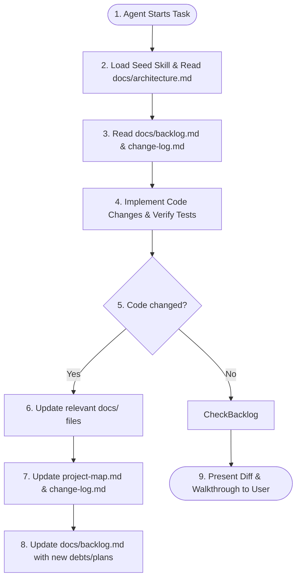

# EVA · Closed-Loop Self-Improvement & Living Documentation

This document defines the mandatory closed-loop documentation and self-improvement system. It is designed to minimize context token usage, eliminate documentation drift, and maintain a high-density project state across all AI agents (Claude, Codex, Antigravity, etc.) working on this repository.

---

## The Closed-Loop Workflow

At the start and end of every task/request, the active AI agent must execute this workflow:



---

## Mandatory End-of-Task Checklist for Agents

Before completing a request and outputting the final response, you **MUST** execute the following steps:

### 1. Update Living Documentation (`docs/`)
If your change touched the database schema, folder layout, module relationships, or system behaviors, you must update:
- [architecture.md](file:///Users/djoker/code/eva02/docs/architecture.md) (if layers or wiring changed).
- [process_flows.md](file:///Users/djoker/code/eva02/docs/process_flows.md) (if state machine, agent loops, or sequences changed).
- [implementation_guide.md](file:///Users/djoker/code/eva02/docs/implementation_guide.md) (if new rules, RLS policies, env vars, or testing practices are introduced).
- [project_sections.md](file:///Users/djoker/code/eva02/docs/project_sections.md) (if files/folders were created, deleted, or reassigned).

### 2. Update the Project Seed (`.agents/skills/eva-project-seed/`)
- Update [project-map.md](file:///Users/djoker/code/eva02/.agents/skills/eva-project-seed/references/project-map.md) to reflect the new mapping state.
- Append a compact log entry to [change-log.md](file:///Users/djoker/code/eva02/.agents/skills/eva-project-seed/references/change-log.md) containing the exact files touched, tests run, and the next pending item.
- Preferred append command:
  ```bash
  python3 .agents/skills/eva-project-seed/scripts/update_seed.py \
    --change "area: compact description of what changed" \
    --files "path/a.ts,path/b.sql" \
    --tests "npm test" \
    --pending "next improvement, risk, or test gap"
  ```
  *(Fallback: Manually append the entry using the established text formatting in `change-log.md`).*

### 3. Update the Living Backlog (`docs/backlog.md`)
- If your implementation introduced technical debt, unresolved edge cases, pending features, or requires further optimization, you **MUST** record it in [backlog.md](file:///Users/djoker/code/eva02/docs/backlog.md).
- Keep backlog items categorized, brief, and actionable.

---

## Token Conservation Goals
By keeping these documentation files compact (using lists, tables, and Mermaid syntax instead of long paragraphs), we ensure that any agent can load the entire project context within **under 15k tokens**, leaving the remaining context window available for pure code analysis and execution.
