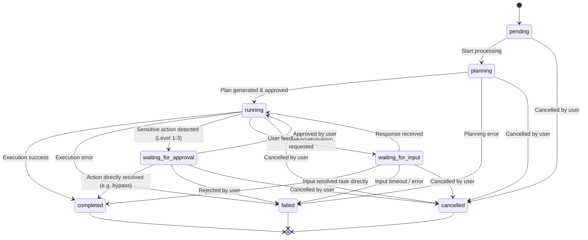
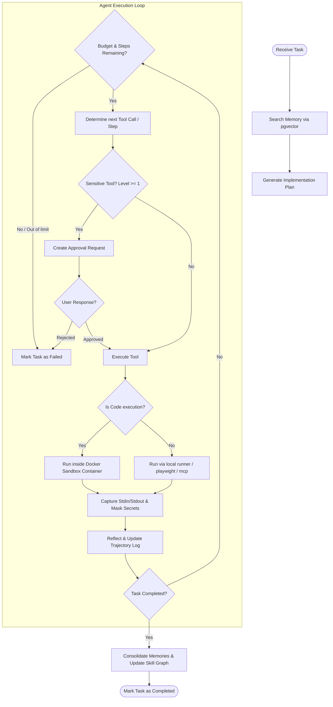
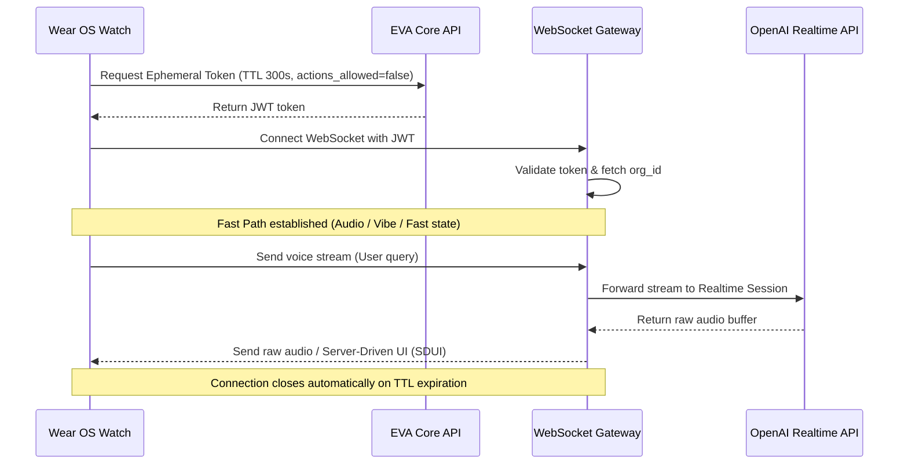
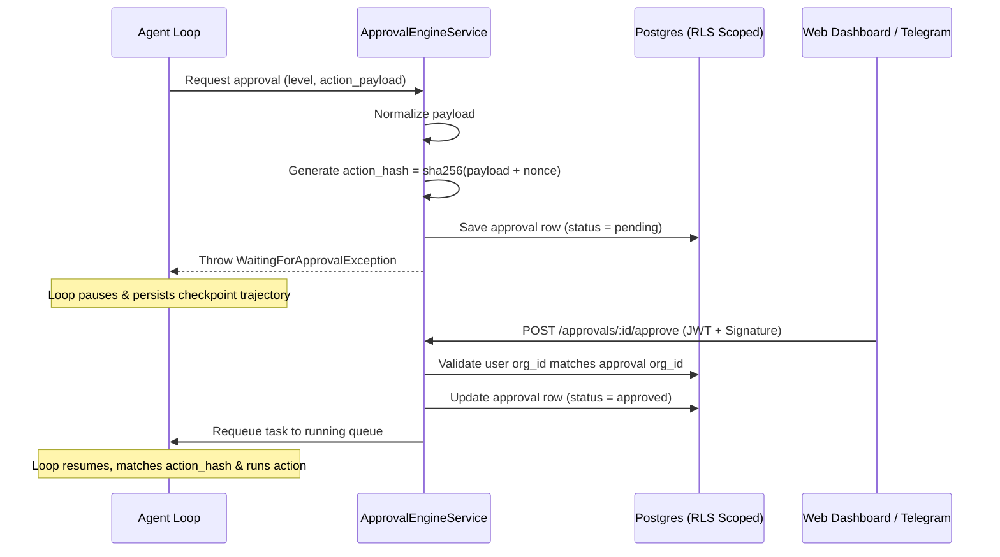

# EVA · Process Flows

This document details the main operational flows of the EVA Agentic Platform using Mermaid diagrams.

## 1. Task State Machine

The task transitions from creation to completion or failure. Non-terminal states can be cancelled at any point.

---

## 2. Core Agent Loop (`AgentLoopService`)

The step-by-step loop execution for planning, action selection, sandbox run, and reflection.

---

## 3. Fast Path & Watch UI Communication

Ephemeral watch interactions designed for real-time speech and instant reactive tasks.

---

## 4. Approval Engine Validation Flow

Securing sensitive capabilities (data deletion, financial payments, deployments).

### Conversational Approval UX (Telegram / chat)
- The approval ask is **one short human message**: what will be executed + `responde "sí" o "no"`. No hashes, levels, expiry, or screenshot links reach the user.
- Flows that already deliver their own conversational ask (runner WhatsApp/Gmail/Calendar handlers) create the approval with `notify: false` so the Communication Hub does not send a duplicate message; agent-loop tools keep the default notification and instruct the model to close with a brief confirmation.
- `APPROVE_KEYWORDS` / `REJECT_KEYWORDS` in `agent-runner.service.ts` accept natural replies ("sí, envíalo", "dale", "mejor no", "cancélalo") and resolve the latest pending approval; `approval.resolved` then triggers `executeApprovedAction`.
- **Evidence on demand only**: screenshots/images are sent only when the user explicitly asked for them (`wantsEvidence()` in `agent/evidence.ts`, persisted as `payload.send_evidence` on the approval). The WhatsApp QR is the exception — it is always sent when linking is required.
- Long-tier tasks emit a short ack (`task.say`) **before** soul/agenda/memory context loading, so the user hears EVA in <1s.
